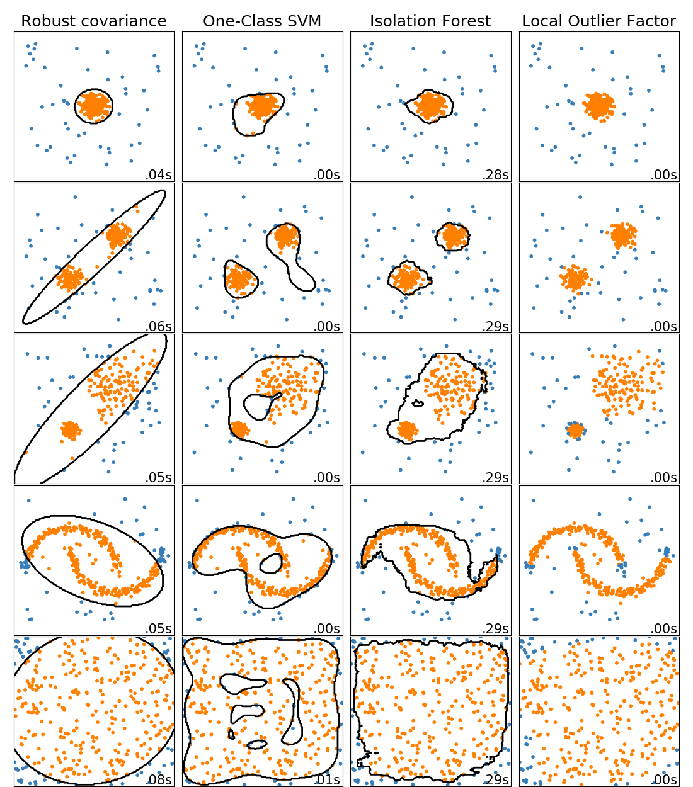

README
===========================

|Author|Tandesen|
|---|---
|EY_Profile|[![EY-profile]][homepage]
|Favorites|Potato and Ice-tea!
|Contact|![Contact]
----

`Scikit-learn` is probably the most useful library for machine learning in python. The sklearn library contains a lot of efficient tools for machine learning and statistical modeling including `classification`, `regression`, `clustering` and `dimensionality reduction`[\[1\]](#references).  

For my position as a forensic data analyst, I found the [Outlier Detection Algorithms](https://scikit-learn.org/stable/modules/outlier_detection.html "Bazinga!") fairly useful. There are four algorithms contained in the link above for outlier detection. I.e., `Robust Covariance`, `One-Class SVM`, `Isolation Forest` and `Local Outlier Factor`. Let me introduce some related terminologies first and then briefly discuss the theories behind these algorithms as far as I am concerned.  

__Some Terminologies__  
* ___Feature___: One may understand a feature as a column from the structured data. The formal definition from wikipedia is: `In machine learning and pattern recognition, a feature is an individual measurable property or characteristic of a phenomenon being observed.`  
* ___Label___: Label is the output/result, is what people are attempting to predict or forecast. For example, in a J&E dataset, a label for one row can be either `legal` or `illegal`. Our original data are usually unlabeled. I.e., for a given row in the original data, we do not know whether it is legal or illegal, and we usually perform KRI analysis to detect illegal entries. Machine learning with unlabeled data is called unsupervised machine learning as the next terminology.
* ___Unsupervised Machine Learning___: Definition from wikipedia: Unsupervised learning is a type of machine learning that looks for previously undetected patterns in a data set with no pre-existing labels and with a minimum of human supervision.

One should realize that the outlier detection is usually an unsupervised learning. Thus typical clustering algorithms may serve, for example the `K-means Clustering` with k equals to 1. Since I haven't dived deeply into these clustering algorithms, let us leave them for the moment and go back to the four algorithms mentioned in the second paragraph.  

Given n features chosen, one row of data denotes a point in the n-dimensional space. The main idea of these four algorithms is to separate points in the n-dimensional space which are `far away` from other points, while they differ in details.  

* ___Robust Covariance___: This algorithm assumes our dataset to be [Gaussian distributed](https://en.wikipedia.org/wiki/Normal_distribution). One should also understand the [Mahalanobis Distance](https://en.wikipedia.org/wiki/Mahalanobis_distance#:~:text=The%20Mahalanobis%20distance%20is%20a,from%20the%20mean%20of%20D.) which measures the distance between a point and a distribution. The very basic idea of this algorithm is to detect points which are far away from the distribution based on the Mahalanobis Distance. I personally have no idea how to determine whether a given dataset is Gaussian distributed or not, and this is fatal because Robust Covariance algorithm is [sensitive to outlying data](https://scikit-learn.org/stable/auto_examples/covariance/plot_mahalanobis_distances.html#sphx-glr-auto-examples-covariance-plot-mahalanobis-distances-py), which means this algorithm provides poor results for highly contaminated dataset.  
* ___One-Class SVM___: This algorithm projects points from n dimensional space to n+1 dimensional space with `kernel functions` and obtains a hypersphere with minimized volume to minimize the effect of incorporating outliers in the solution[\[2\]](#references). I have no idea about the details of how to obtain such a hypersphere, one may find more details online.
* ___Isolation Forest___: This algorithm is much more reasonable and used in most cases. For every point(say A) in our n-dimensional space, we find a hyperplane which is orthogonal to a random axis to split the space into two parts, and for the part containing the point A, we find another hyperplane based on the same rule. We continue this progress until the point A is isolated in one hand of the n-th hyperplane, i.e., point A is the sole point 'wraped' by n hyperplanes. Then the smaller n is, the more likely point A is an outlier. In practice, we do several such progresses for each point and we can describe one progress as a [tree structure](https://en.wikipedia.org/wiki/Decision_tree#Overview). The 'depth' of a tree illustrates the soleness of the point and the 'depths' of all trees illustrate the overall soleness of the point(much more issues here: how many trees to choose, maximal depth of one tree, how to 'integrate' the 'depths' of all trees, etc.)
* ___Local Outlier Factor___: This algorithm is also widely used. For a given point A, LOF algorithm computes the local density of point A as well as the average of its k-near points' local densities. Computing the ratio of local density of point A and of its k-near points', we assign a score(called local outlier factor) to each point which reflects its soleness. Please refer to [this link](https://scikit-learn.org/stable/modules/outlier_detection.html#local-outlier-factor) for more details.  

I will upload python codes for these algorithms using data provided in the root/data file. Please refer to notes in python codes and use `Jupyter Notebook` to open `.ipynb` files. Finally let us see the following illustrations from sklearn of the four algorithms introduced above.  

----
## References
### \[1\]:[https://scikit-learn.org/stable/](https://scikit-learn.org/stable/)
### \[2\]:[http://rvlasveld.github.io/blog/2013/07/12/introduction-to-one-class-support-vector-machines/](http://rvlasveld.github.io/blog/2013/07/12/introduction-to-one-class-support-vector-machines/)

--------------------------------
[homepage]:https://people.ey.com/PersonImmersive.aspx?accountname=i%3A0%23%2Ef%7Cmembership%7Cmark%2Es%2Etan%40cn%2Eey%2Ecom "My real name is Tandesen! Bazinga!"
[EY-profile]:https://img.shields.io/badge/Tandesen-EY__Profile-blue
[Contact]:https://img.shields.io/badge/Wechat-markts28-brightgreen "Add me beauties!"
